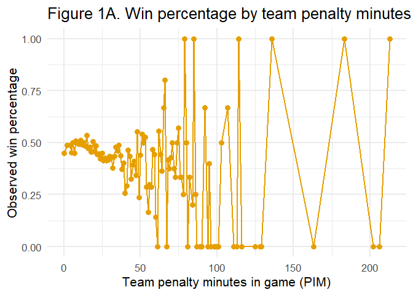
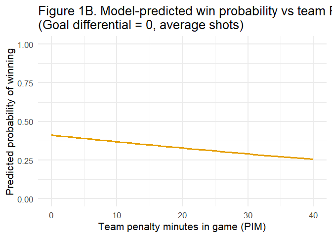
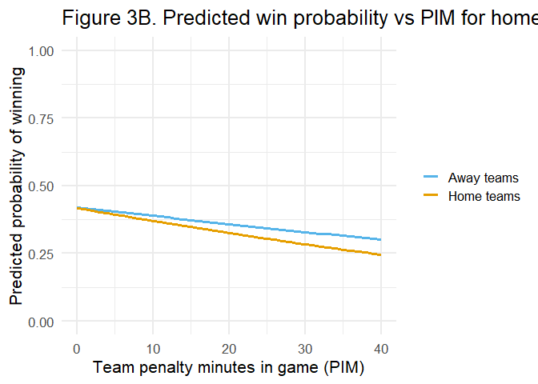

# NHL Win Probability Modeling (R)

## Overview
This repository presents an **applied econometrics / data analytics** project that models **NHL win probability** using team-game level statistics in **R**.

The goal is to quantify how discipline (penalty minutes), offensive/defensive performance (shots, goal differential), special teams metrics (power-play variables), and game context (home/away) relate to the probability of winning—while controlling for the strongest confounders.

## Data
- **Unit of analysis:** team-game (each NHL game appears twice: once for the home team and once for the away team).
- **Sample size:** ~47k+ team-game observations after cleaning (depends on the local dataset used).
- **Outcome:** `win` (1 = win, 0 = loss).
- **Example predictors:**
  - Discipline: penalty minutes (PIM)
  - Performance controls: goal differential, shots for/against
  - Special teams: power-play goals, power-play opportunities, net power-play opportunities
  - Context: home vs away indicator

> **Data note:** This repo is designed as a **portfolio project** and does **not** redistribute any course-provided data files.  
> To reproduce results, place your dataset locally (e.g., `data/game_teams_stats.csv`) and update the file path in the analysis script.
## Key Figures

### Distribution of team penalty minutes


### Model-predicted win probability vs penalty minutes


### Home vs away predicted win probability


## Repository Contents

- `analysis_portfolio.Rmd` — main analysis code
- `REPORT.md` — written project report
- `data/` — sample data / data notes
- `figures/` — exported figures used in the project

## Notes

This repository is a portfolio version of the project. It includes cleaned code, selected figures, and documentation suitable for public presentation.


## Methods
- **Logistic regression (GLM, binomial):**  
  `glm(win ~ X, family = binomial(link = "logit"))`
- **Odds ratios & confidence intervals** for interpretability
- **Interaction terms** (e.g., Home × PIM) to test moderation
- **Model diagnostics / robustness checks** where appropriate
- **Visualization** of predicted win probabilities holding key controls constant

## Key Results (high level)
- **Penalty minutes (PIM)** show a consistent **negative association** with win probability after controlling for major performance factors.
- **Goal differential** is the strongest predictor of winning, as expected.
- Some descriptive relationships (e.g., raw special-teams opportunity counts) can weaken after controlling for scoring-related variables—highlighting confounding.

## How to Run
1. Open `nhl_win_probability_portfolio.Rmd` (or the main analysis file) in RStudio.
2. Install packages (if needed):
   ```r
   install.packages(c("tidyverse","broom","ggplot2","sandwich","lmtest"))
   ```
3. Update the dataset path in the script and run.

## Skills Demonstrated
- R programming (tidyverse)
- Logistic regression / GLM
- Interpreting odds ratios and uncertainty (CI/p-values)
- Data cleaning, feature engineering, and visualization
- Translating statistical output into clear business-style insights


A longer written research paper is available upon request.
